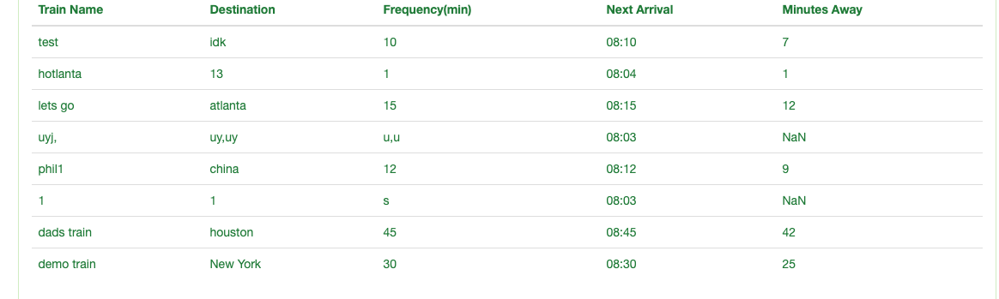

# Train-Schedule
Real time train schedule 

<h1>Train Schedule</h1>

<h3>Overview</h3>

Train-Schedule is a web application that takes in user input about a train (train name, destination, first train time, and frequency) and displays the following information about the train:
<ul>
<li>train name</li>
<li>destination</li>
<li>frequency</li>
<li>minutes away</li>
</ul>

Next arrival and minutes away are automatically calculated as current time passes.

<h3>Technologies Used</h3>
<ul>
<li>Javascript</li>
<li>jQuery</li>
<li>CSS</li>
<li>HTML</li>
<li>Moment.js</li>
</ul>

<h3>Screenshots Of How It Works</h3>

  
 

  

  
 

 

 

  
 

 

